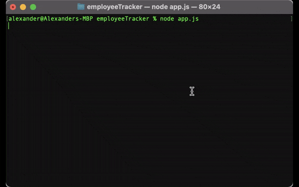

  # Employee Tracker
  
## Description
🔍 A database schema containing three tables. Department, Role and Employee. The Role table refrences the Department table by department_id. This allows for each role to be asigned to a specific department.The Employee table now refrences the Role table so that employee can be assigned to a specific role.
## Table of Contents
- [Description](#description)
- [Installation](#installation)
- [Tests](#tests)
- [Questions](#questions)
## Installation
💾 
1. Clone Repository
2. npm i 
3. node app.js
## Tests
✏️ 
Terminal Demo 

## Questions
✋ 
Alexander Noriega
email: alexnoriega47@gmail.com

    